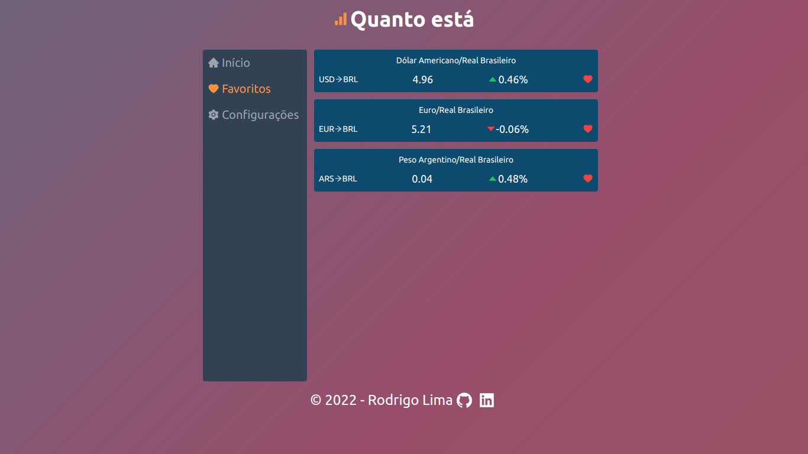
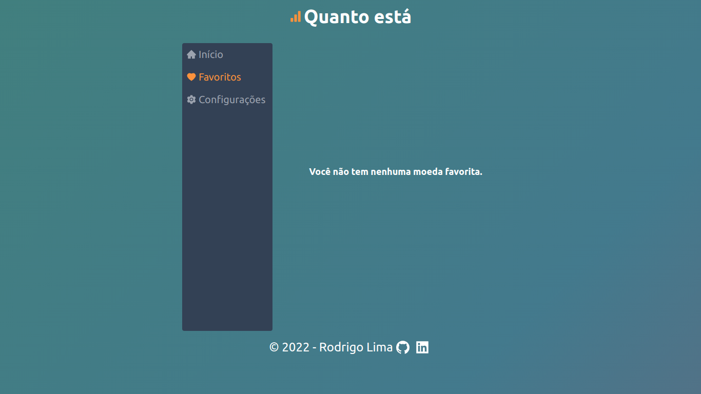

# Quanto está

Projeto pessoal para treinar as minhas skills com Typescript e React. Essa aplicação mostra o valor da cotação de algumas das principais moedas do mercado, sendo seus valores possíveis de serem convertidos para BRL (Real Brasileiro), USD (Dolar Americado) ou EUR (Euro). Não deixe de conferir o [Quanto está](https://quanto-esta.rodrigolimajesus.vercel.app/).

O projeto foi feito em React Js + Typescript, para o gerenciamento de estados globais foi feito o uso de Context Api, e para a estilização foi usado o Tailwind CSS.

Abaixo é possível ver algumas das telas já feitas.

# Página Inicial

# Página de favoritos

# Página de configurações

### Feedbacks são muito bem vindos, sem eles tenho certeza que eu não conseguiria ter me desenvolvido até aqui, fiquem a vontade para contribuir!!

# Caso queira testar o projeto na sua máquina

1. Clone o projeto para sua máquina.

- `git clone git@github.com:RodrigoLimaJesus/quanto-esta.git`

2. Entre no diretório da aplicação.

- `cd quanto-esta`

3. Instale as dependências.

- `npm install`

4. Coloque o projeto para rodar

- `npm start`
